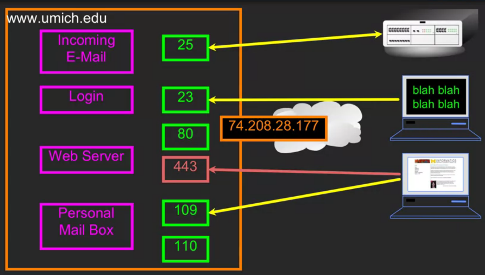

## Introduction to Networking

Layered Architecture:

### Transport Control Protocol (TCP)

- Built on top of IP (Internet Protocol)
- Assumes IP might lose some data - stores and retransmites data if it seems to be lost.
- Handles "flow control: using transmit window
- Proce a nice reliable <strong><i>pipe</i></strong>


###### What is it?

``` 
There is this layered architecture (shown in the figure below)
that basically represents the connection over the Internet and it represents two computers,
and there's application, talks to a transport layer,
which talks to an Internet layer,
which talks to the link layer and that talks to the Wi-Fi or Ethernet connection.

It goes through a bunch of hops on the network, maybe 10, 12, 15, 
and it comes at the end of the destination could be that maybe this is a web server or something.

It goes up through these layers and then runs
a web application and then the data is then sent back,
out the same path back up 15 hops,
up and then back into your application and then to your screen.
```


##### Communication between two applications

- An end-to-end layer in the network architecture called the transport layer.

- The idea is as we write Python program that will talk out the transport layer over to an application on another server. 

- The Internet layer and the link layer implement the transport layer.

- There is a nice pipe from end-to-end that when your program says something down the pipe the program on the other end hears it, and when that program sends something back, you can hear it on your end. 


#### TCP Connections/Sockets

In computer networking, an internet socket or network socket is an endpoint of a bidirectional inter-process communication flow across an Internet Protocol based Computer network, such as the Internet.

```

Process    <----  INTERNET   ---->    Process


```

- All the web servers have names, and numbers, and points. 

- Different applications on that server are listening on what are called ports. 

```

    You could think of them almost as telephone number extensions.
    So, you call a large company they've got one phone number and it says,
    "Enter the extension if you know it."
    Well, that means you've called the company but you really want to talk to a person.
    So these ports, these TCPIP ports.
    These little ports, are different applications
    associate themselves with these ports when they start up. 

```

#### Port

- A port is an <strong>application-specific</strong> or process-specific software communications endpoint.

- It allows multiple networked applications to coexist on the same server.

- There is a list of well-known TCP port number.


```
    These ports, TCPIP ports, These little ports, are different applications
    associate themselves with these ports when they start up.
    So, the incoming email server might be on port
    25 and it wakes up and it sits there waiting for something to happen.

    So, our applications.
    If the user wants to send some mail,
    he is going to connect to a server but on port 25
    and that way user hope to talk to the email server. 

```




#### Common TCP Ports


| HTTPS(80); |  HTTPS(443); |
|-	|-	|


```
    Port 80 is the web port because that's the part that's connected to the server.
    Port 443 is the secure HTTPS.
    So, when you connect to a web server.
    So, if you're a browser and you want to connect to a web server,
    you go to a hostname or number and then you connect to
    port 80 and then hopefully if there is a web server on that host,
    you'll be talking to the web server on port 80. 

```


| Telnet(23) - Login 	; |  IMAP(143/220/993) - Mail Retrieval ; 	|
|-	|-	|

|SSH(22) - Secure Login;	| POP(109/110) - Mail Retrieval;	|
|-	|-	|


| SMTP (25)	 (Mail); |	FTP (21) File Transfer|
|-	|-	|


| DNS (53) - Domain Name	|	|
|-	|-	|


#### Standard Practice


```
    Sometimes you'll even go on the web and cruise around and see
    a URL that is a little different that has something 
    like a colon 8080 on it.
    Well, this basically is the syntax for URLs host and then
    colon 8080 is the port.
    So, this is basically a web server that's not running on port 80,
    but running on port 8080.
    So, it's not like they have to be on these ports,
    but we commonly expect them to be on ports.
    Normally there's going to be a web server on port 80.
    If there is a web server,
    there might not be a web server on port 80. 

```
